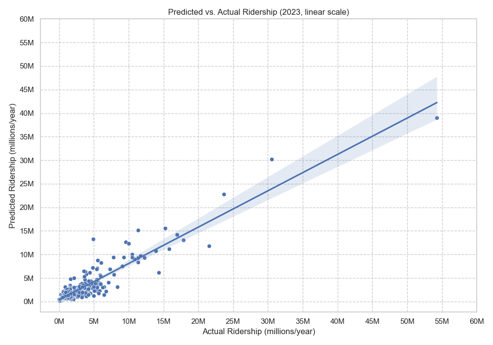
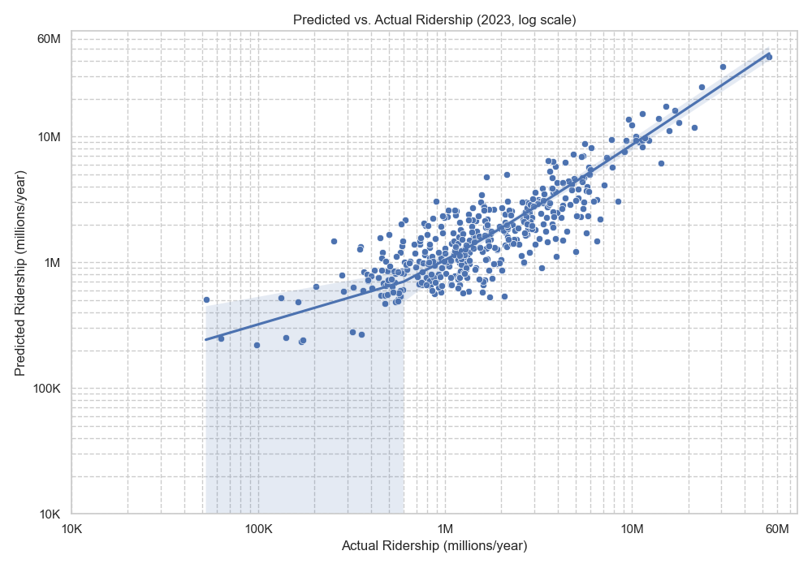

# Modeling and Predicting NYC (and Surrounding Areas) Transit Demand

## Introduction

This project was created as part of a larger project to devise a plan for much-needed rapid transit (subway/metro) expansion in the NYC metro area. I needed a way to estimate rapid transit ridership at any location within the tri-state area in order to statistically support decisions (such as station locations, route alignments, and proposed service frequencies) within the plan.

I developed a model to do just that, based on realistically available parameters: population density, job density, distance to Midtown Manhattan, the amount of service the station receives or might receive, whether it is a terminus station, whether it's ADA accessible, and whether it's a "commuter" station (a station with a transfer to commuter rail or a bus terminal, for example). In the model, these parameters are represented by `DENSITY_BG`, `JOB_DENSITY_BG_LOG` (log-transformed), `DISTANCE`, `TOTAL_FREQUENCY` (log-transformed), `TERMINUS`, `ADA`, and `COMMUTER`, respectively. There is also an additional variable `FREQUENCY-COMMUTER_INTERACTION` that represents the interaction between `TOTAL_FREQUENCY` and `COMMUTER`.

A number of publically-available resources were used in order to complete this project—these can be found below in the Sources section.

## Results

### Findings
- Increased service frequency is strongly correlated with greater ridership. The regression results indicate that a 1% increase in frequency at a station is associated with a ~0.79% increase in ridership. However, this isn't purely causal. Increasing service to a station will likely boost ridership due to the convenience factor, but at the same time, a station might be allocated more service because of *other* factors that boost ridership.
- Ridership tapers off sharply as distance from Midtown Manhattan increases.
- Greater job concentration boosts ridership. The regression results indicate that a 10% increase in job density is associated with a ~1% increase in ridership.
- ADA-accessible stations tend to have greater ridership. However, because the MTA has historically focused on important and high-ridership stations for accessibility retrofit projects, there is not strong causality.
- Terminal stations have ~57.5% greater ridership than equivalent non-terminal stations. These stations are often major multi-modal transfer points, collecting riders from a far greater catchment area than the typical rapid transit station, leading to increased ridership.
- Commuter-categorized stations see ~30 times greater ridership than equivalent non-commuter stations. These stations, which serve as transfer points between rapid transit and commuter-oriented modes (like the LIRR, Metro-North, and NJ Transit), are regional hubs and act as gateways to New York City and its rapid transit system. They draw in riders from wide swaths of the metropolitan area (and even the country via regional and long-distance Amtrak services), resulting in massive ridership numbers.
- The effect of population density in the area surrounding a station on ridership—while statistically significant—is less substantial than expected.

### Insights
- Ridership is highly centralized due to the structure of the system and the city (see: distance variable). Adding service that de-centralizes the system could unlock a new level of ridership
- Multi-modal/transfer stations are highly-used, suggests that that should be a focus in future plans (e.g. plan feeder buses for stations to draw in ridership and increase catchment area)
- Land use can make or break ridership at a station, so planning for areas surrounding stations and meeting people where they are is important

### Plots

## Instructions
1. Run `datacleaning.py`.
2. To run the model and view the model summary, run `regression.py`.
3. To run the model and generate plots, run `plot.py`. You must run
`regression.py` first in order to generate the plots.
4. To predict ridership at given stations/locations, run `predict.py`.
A sample dataset of stations/locations is provided in `sample.csv`, which is
the data `predict.py` uses. Modify this table to predict ridership for
stations/locations of your own choosing. To do so, you must include a name
for the station, its latitude and longitude coordinates, the lines that serve
the station, whether it's a terminal station, whether it's a commuter station,
and whether it's a transfer station. You can also edit `sample_frequencies.csv`
to include custom frequency data for any additional lines you include. However,
this isn't mandatory, and a default value of 10 trains per hour will be
assigned if you choose to add a new line. A new table with the predicted
ridership will be saved to `calculated_ridership.csv`.

## Documentation and Notes
`LOG_2023`: 2023 total ridership for each station. Log-transformed in order to counteract the effect of high-ridership stations skewing the data.

`LOG_2019`: 2019 total ridership for each station. Log-transformed in order to counteract the effect of high-ridership stations skewing the data. Included to provide a pre-pandemic baseline.

`JOB_DENSITY_BG_LOG`: Log-transformed in order to counteract the effect of heavily-skewed job density geographic data.

`TOTAL_FREQUENCY`: Combines average weekday TPH values (sourced from [NYC Subway Frequencies (Gregory Feliu)](https://github.com/gregfeliu/NYC-Subway-Frequencies)) for each service that serves a station. Log-transformed to counteract its skewed distribution towards station hubs with many lines that combine for extremely frequent service.

`TERMINUS`: Possible values are 0 (not a terminal station) or 1 (a terminal station). For stations where one line terminates but others don't, the value for `TERMINUS` should be assigned at your discretion.

`ADA`: Possible values are 0 (not ADA-accessible) or 1 (ADA-accessible). In `sample.csv` (where you would add station data of your choice), `ADA` is not included in the columns. This is because it is assumed that any future stations would be ADA-accessible, as is required by federal law.

`COMMUTER`: Possible values are 0 (not a commuter station), 0.5 (minor commuter station), or 1.0 (major commuter station). The reason for the distinction between minor and major is that a station like Atlantic Av-Barclays Center, while still a commuter hub, is nowhere near as significant as Grand Central-42 St and should be reflected as such in the data. Additionally, I assigned the value 0.5 to each 34 St-Penn Station because the commuter hub effect from Penn Station is split between the station on the Broadway–Seventh Avenue Line and the station on the Eighth Avenue Line. For additional stations of your choosing that you'd like to predict, the value for `COMMUTER` should be assigned at your discretion.

`FREQUENCY-COMMUTER_INTERACTION`: I found that the model was overestimating ridership at major commuter hubs, so I introduced an interaction between `TOTAL_FREQUENCY` and `COMMUTER` to counteract this.

## Sources
1. [MTA 2023 Subway Ridership Data](https://www.mta.info/agency/new-york-city-transit/subway-bus-ridership-2023)
2. [MTA Subway Stations (NY Open Data)](https://data.ny.gov/Transportation/MTA-Subway-Stations/39hk-dx4f/data_preview)
3. [American Community Survey 5-Year Data](https://www.census.gov/data/developers/data-sets/acs-5year.html)
4. [LEHD Origin-Destination Employment Statistics (LODES) Workplace Area Characteristics (WAC) Data](https://lehd.ces.census.gov/data/)
5. [NYC Subway Frequencies (Gregory Feliu)](https://github.com/gregfeliu/NYC-Subway-Frequencies)
