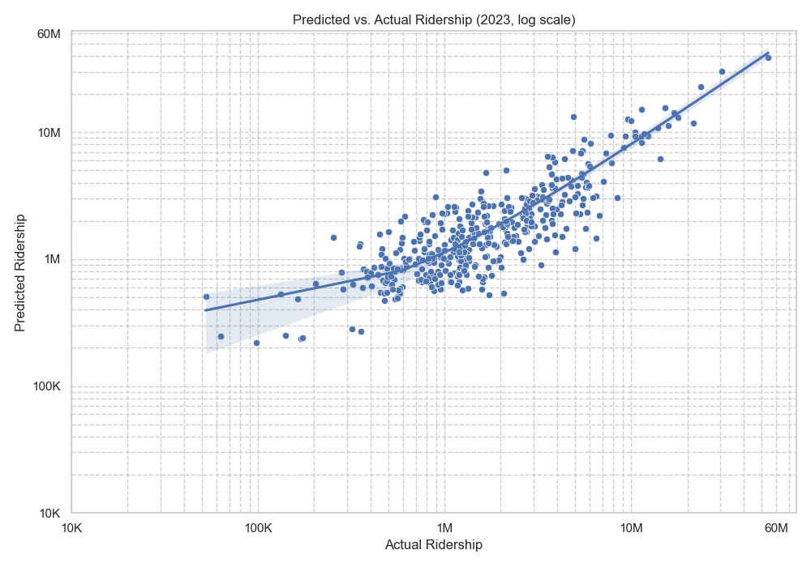

# Modeling and Predicting NYC (and Surrounding Areas) Transit Demand

## Model Results
```
                            OLS Regression Results                            
==============================================================================
Dep. Variable:               LOG_2023   R-squared:                       0.702
Model:                            OLS   Adj. R-squared:                  0.696
Method:                 Least Squares   F-statistic:                     120.5
Date:                Tue, 01 Jul 2025   Prob (F-statistic):          1.40e-102
Time:                        21:14:42   Log-Likelihood:                -332.32
No. Observations:                 418   AIC:                             682.6
Df Residuals:                     409   BIC:                             719.0
Df Model:                           8                                         
Covariance Type:            nonrobust                                         
=====================================================================================
                        coef    std err          t      P>|t|      [0.025      0.975]
-------------------------------------------------------------------------------------
const                11.8028      0.294     40.133      0.000      11.225      12.381
LOG_B_JOB_DENSITY     0.0994      0.020      5.065      0.000       0.061       0.138
DISTANCE             -6.8614      0.639    -10.730      0.000      -8.118      -5.604
TERMINUS              0.4546      0.132      3.434      0.001       0.194       0.715
TOTAL_FREQ            0.7942      0.071     11.136      0.000       0.654       0.934
ADA                   0.2581      0.059      4.347      0.000       0.141       0.375
COMMUTER              3.3727      1.075      3.139      0.002       1.260       5.485
FREQ_X_COMMUTER      -0.6323      0.297     -2.128      0.034      -1.216      -0.048
B_DENSITY             0.0840      0.027      3.100      0.002       0.031       0.137
==============================================================================
Omnibus:                       13.631   Durbin-Watson:                   1.881
Prob(Omnibus):                  0.001   Jarque-Bera (JB):               17.024
Skew:                          -0.318   Prob(JB):                     0.000201
Kurtosis:                       3.757   Cond. No.                         492.
==============================================================================
```

## Plots



## Instructions
You can start from step [] but if you want to start from the beginning:
1. Run `datacleaning.py`
2. To run the model and view the model summary, run `regression.py`.
3. To run the model and generate plots, run `plot.py`. You must run
`regression.py` first in order to generate the plots.
4. To predict ridership at given stations/locations, run `predict.py`.
A sample dataset of stations/locations is provided in `sample.csv`, which is
the data `predict.py` uses. Modify this table to predict ridership for
stations/locations of your own choosing. To do so, you must include a name
for the station, its latitude and longitude coordinates, the lines that serve
the station, whether it's a terminus station, whether it's a commuter station,
and whether it's a transfer station. You can also edit `sample_frequencies.csv`
to include custom frequency data for any additional lines you include. However,
this isn't mandatory, and a default value of 10 trains per hour will be
assigned if you choose to add a new line. A new table with the predicted
ridership will be saved to `calculated_ridership.csv`.

## Sources
1. [MTA 2023 Subway Ridership Data](https://www.mta.info/agency/new-york-city-transit/subway-bus-ridership-2023)
2. [MTA Subway Stations (NY Open Data)](https://data.ny.gov/Transportation/MTA-Subway-Stations/39hk-dx4f/data_preview)
3. [American Community Survey 5-Year Data](https://www.census.gov/data/developers/data-sets/acs-5year.html)
4. [LEHD Origin-Destination Employment Statistics (LODES) Workplace Area Characteristics (WAC) Data](https://lehd.ces.census.gov/data/)
5. [NYC Subway Frequencies (Gregory Feliu)](https://github.com/gregfeliu/NYC-Subway-Frequencies)
